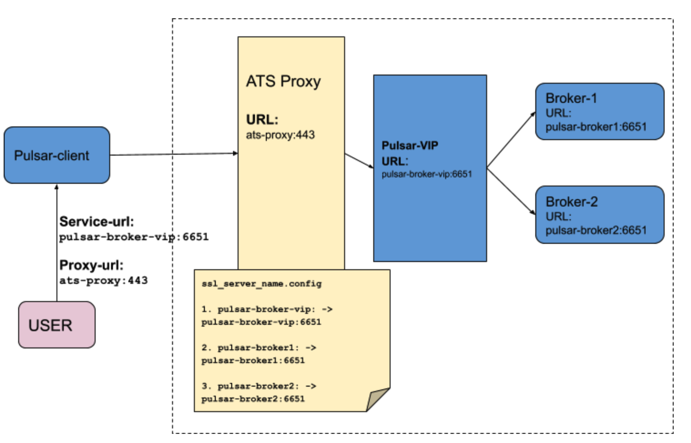
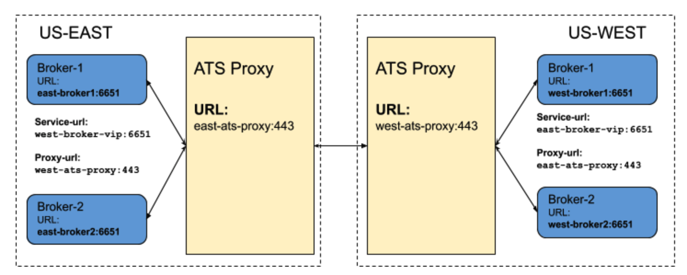

## Pulsar Proxy with SNI routing

A proxy server is an intermediary server that forwards requests from multiple clients to different servers across the Internet. The proxy server acts as a "traffic cop" in both forward and reverse proxy scenarios, and benefits your system such as load balancing, performance, security, auto-scaling, and so on.

The proxy in Pulsar acts as a reverse proxy, and creates a gateway in front of brokers. Proxies such as Apache Traffic Server (ATS), HAProxy, Nginx, and Envoy are not supported in Pulsar. These proxy-servers support **SNI routing**. SNI routing is used to route traffic to a destination without terminating the SSL connection. Routing at layer 4 provides greater transparency because the outbound connection is determined by examining the destination address in the client TCP packets.

Pulsar clients support [SNI routing protocol](https://github.com/apache/pulsar/wiki/PIP-60:-Support-Proxy-server-with-SNI-routing), so you can connect to brokers through the proxy. You learn how to set up the ATS proxy and the Pulsar client to enable SNI routing, and connect Pulsar client to the broker through the ATS proxy.

### ATS-SNI Routing in Pulsar
To support [layer-4 SNI routing](https://docs.trafficserver.apache.org/en/latest/admin-guide/layer-4-routing.en.html) with ATS, the inbound connection must be a TLS connection. Pulsar client supports SNI routing protocol on TLS connection, so when Pulsar clients connect to broker through ATS proxy, Pulsar uses ATS as a reverse proxy.

Pulsar supports SNI routing for geo-replication, so brokers can connect to brokers in other clusters through the ATS proxy.

Therefore, this section explains how to set up and use ATS as a reverse proxy so pulsar clients can connect to brokers through the ATS proxy using SNI routing protocol on TLS connection. 

#### Set up ATS Proxy for layer-4 SNI routing



To support layer 4 SNI routing, you need to configure the `records.conf` and `ssl_server_name.conf` files.

The [records.config](https://docs.trafficserver.apache.org/en/latest/admin-guide/files/records.config.en.html) file is located in the `/usr/local/etc/trafficserver/` directory by default. The file lists configurable variables used by the Apache Traffic Server.

- Update TLS port (`http.server_ports`) on which proxy listens, and update proxy certs (`ssl.client.cert.path` and `ssl.client.cert.filename`) to secure TLS tunneling. 
- Configure server ports (`http.connect_ports`) used for tunneling to the broker. If Pulsar brokers are listening on `4443` and `6651` ports, add the brokers service port in the `http.connect_ports` configuration.

The following is an example.

```
# PROXY TLS PORT
CONFIG proxy.config.http.server_ports STRING 4443:ssl 4080
# PROXY CERTS FILE PATH
CONFIG proxy.config.ssl.client.cert.path STRING /proxy-cert.pem
# PROXY KEY FILE PATH
CONFIG proxy.config.ssl.client.cert.filename STRING /proxy-key.pem


# The range of origin server ports that can be used for tunneling via CONNECT. # Traffic Server allows tunnels only to the specified ports. Supports both wildcards (*) and ranges (e.g. 0-1023).
CONFIG proxy.config.http.connect_ports STRING 4443 6651
```

The [ssl_server_name](https://docs.trafficserver.apache.org/en/8.0.x/admin-guide/files/ssl_server_name.yaml.en.html) file is used to configure TLS connection handling for inbound and outbound connections. The configuration is determined by the SNI values provided by the inbound connection. The file consists of a set of configuration items, each is identified by an SNI value (`fqdn`). When an inbound TLS connection is made, the SNI value from the TLS negotiation is matched with the items specified in this file. If it matches, the values specified in that item override the default values. 

The following example shows mapping of inbound SNI hostname coming from the client, and the actual broker service URL where request should be redirected. For example, if the client sends the SNI header `pulsar-broker1`, the proxy creates a TLS tunnel by redirecting request to the `pulsar-broker1:6651` service URL.

```
server_config = {
  {
     fqdn = 'pulsar-broker-vip',
     # Forward to Pulsar broker which is listening on 6651
     tunnel_route = 'pulsar-broker-vip:6651'
  },
  {
     fqdn = 'pulsar-broker1',
     # Forward to Pulsar broker-1 which is listening on 6651
     tunnel_route = 'pulsar-broker1:6651'
  },
  {
     fqdn = 'pulsar-broker2',
     # Forward to Pulsar broker-2 which is listening on 6651
     tunnel_route = 'pulsar-broker2:6651'
  },
}
```

After you configure the `ssl_server_name.config` and `records.config` files, ATS-proxy server handles SNI routing and creates TCP tunnel between the client and the broker.

#### Pulsar-client Configuration with SNI routing
ATS SNI-routing works only with TLS. You need to enable TLS for the ATS proxy and brokers first, configure the SNI routing protocol, and connect Pulsar clients to brokers through ATS proxy. Pulsar clients support SNI routing by connecting to the proxy, and sending the target broker URL to the SNI header. This process is processed internally. You only need to configure the following proxy configuration initially when you create a Pulsar client to use the SNI routing protocol.

```
String brokerServiceUrl = “pulsar+ssl://pulsar-broker-vip:6651/”;
String proxyUrl = “pulsar+ssl://ats-proxy:443”;
ClientBuilder clientBuilder = PulsarClient.builder()
		.serviceUrl(brokerServiceUrl)
        .tlsTrustCertsFilePath(TLS_TRUST_CERT_FILE_PATH)
        .enableTls(true)
        .allowTlsInsecureConnection(false)
        .proxyServiceUrl(proxyUrl, ProxyProtocol.SNI)
        .operationTimeout(1000, TimeUnit.MILLISECONDS);

Map<String, String> authParams = new HashMap<>();
authParams.put("tlsCertFile", TLS_CLIENT_CERT_FILE_PATH);
authParams.put("tlsKeyFile", TLS_CLIENT_KEY_FILE_PATH);
clientBuilder.authentication(AuthenticationTls.class.getName(), authParams);

PulsarClient pulsarClient = clientBuilder.build();
```

#### Pulsar geo-replication with SNI routing

You can use ATS proxy for geo-replication. Pulsar brokers can connect to brokers in geo-replication by using SNI routing. To enable SNI routing for broker connection cross cluster, you need to configure SNI proxy URL to the cluster metadata. If you have configured SNI proxy URL in the cluster metadata, you can connect broker cross cluster through the proxy over SNI routing.



In this example, a Pulsar cluster is deployed into two separate regions, `us-west` and `us-east`. Both regions are configured with ATS proxy, and brokers in each region run behind the ATS proxy. We configure the cluster metadata for both clusters, so brokers in one cluster can use SNI routing and connect to brokers in other clusters through the ATS proxy.

(a) Configure the cluster metadata for `us-east` with `us-east` broker service URL and `us-east` ATS proxy URL with SNI proxy-protocol.

```
./pulsar-admin clusters update \
--broker-url-secure pulsar+ssl://east-broker-vip:6651 \
--url http://east-broker-vip:8080 \
--proxy-protocol SNI \
--proxy-url pulsar+ssl://east-ats-proxy:443
```

(b) Configure the cluster metadata for `us-west` with `us-west` broker service URL and `us-west` ATS proxy URL with SNI proxy-protocol.

```
./pulsar-admin clusters update \
--broker-url-secure pulsar+ssl://west-broker-vip:6651 \
--url http://west-broker-vip:8080 \
--proxy-protocol SNI \
--proxy-url pulsar+ssl://west-ats-proxy:443
```