[DC/OS](https://dcos.io/) (the <strong>D</strong>ata<strong>C</strong>enter <strong>O</strong>perating <strong>S</strong>ystem) is a distributed operating system used for deploying and managing applications and systems on [Apache Mesos](http://mesos.apache.org/). DC/OS is an open-source tool created and maintained by [Mesosphere](https://mesosphere.com/).

Apache Pulsar is available as a [Marathon Application Group](https://mesosphere.github.io/marathon/docs/application-groups.html), which runs multiple applications as manageable sets.

## Prerequisites

In order to run Pulsar on DC/OS, you will need the following:

* DC/OS version [1.9](https://docs.mesosphere.com/1.9/) or higher
* A [DC/OS cluster](https://docs.mesosphere.com/1.9/installing/) with at least three agent nodes
* The [DC/OS CLI tool](https://docs.mesosphere.com/1.9/cli/install/) installed
* The [`PulsarGroups.json`](https://github.com/apache/incubator-pulsar/blob/master/deployment/dcos/PulsarGroups.json) configuration file from the Pulsar GitHub repo.

  ```bash
  $ curl -O https://raw.githubusercontent.com/apache/incubator-pulsar/master/deployment/dcos/PulsarGroups.json
  ```

Each node in the DC/OS-managed Mesos cluster must have at least:

* 4 CPU
* 4 GB of memory
* 60 GB of total persistent disk

Alternatively, you can change the configuration in `PulsarGroups.json` according to match your DC/OS cluster's resources.

## Deploy Pulsar using the DC/OS command interface

You can deploy Pulsar on DC/OS using this command:

```bash
$ dcos marathon group add PulsarGroups.json
```

This command will deploy Docker container instances in three groups, which together comprise a Pulsar cluster:

* 3 bookies (1  on each agent node and 1 [bookie recovery](http://bookkeeper.apache.org/docs/latest/admin/autorecovery/) instance)
* 3 Pulsar  (1 broker on each node and 1 admin instance)
* 1 [Prometheus](http://prometheus.io/) instance and 1 [Grafana](https://grafana.com/) instance


> When running DC/OS, a ZooKeeper cluster is already running at `master.mesos:2181`, thus there's no need to install or start up ZooKeeper separately.

After executing the `dcos` command above, click on the **Services** tab in the DC/OS [GUI interface](https://docs.mesosphere.com/latest/gui/), which you can access at [http://m1.dcos](http://m1.dcos) in this example. You should see several applications in the process of deploying.

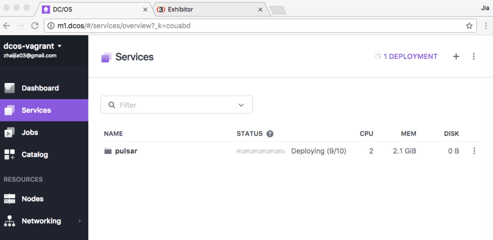

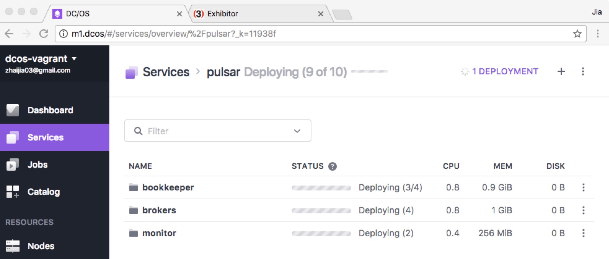

## The BookKeeper group

To monitor the status of the BookKeeper cluster deployment, click on the **bookkeeper** group in the parent **pulsar** group.

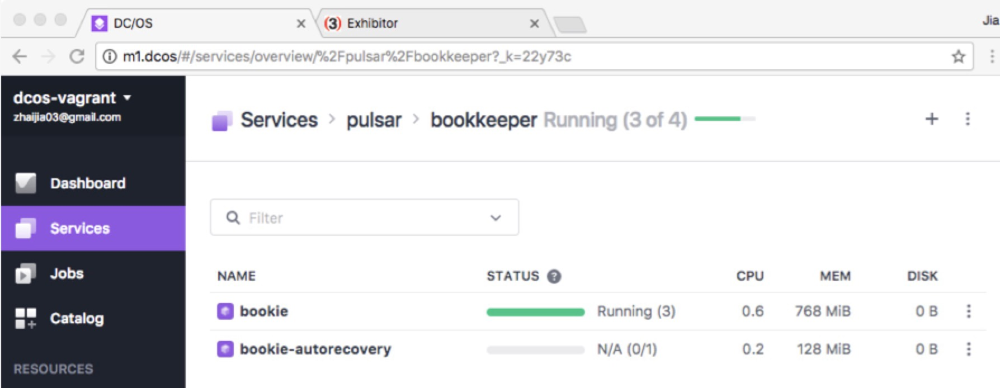

At this point, 3  should be shown as green, which means that they have been deployed successfully and are now running.
 
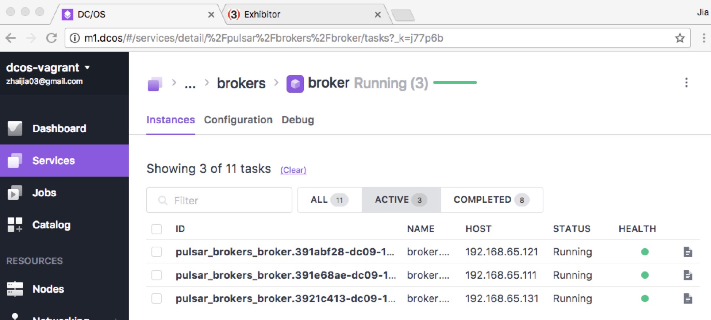
 
You can also click into each bookie instance to get more detailed info, such as the bookie running log.

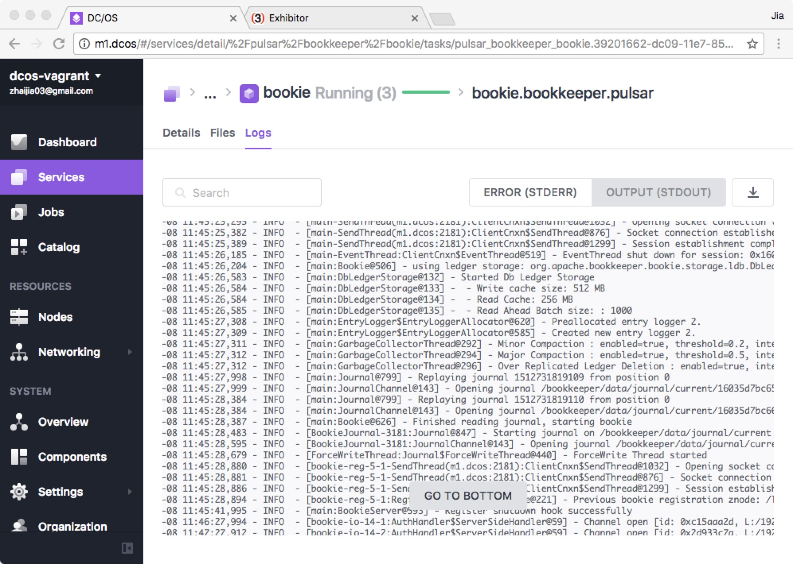

To display information about the BookKeeper in ZooKeeper, you can visit [http://m1.dcos/exhibitor](http://m1.dcos/exhibitor). In this example, there are 3 bookies under the `available` directory.

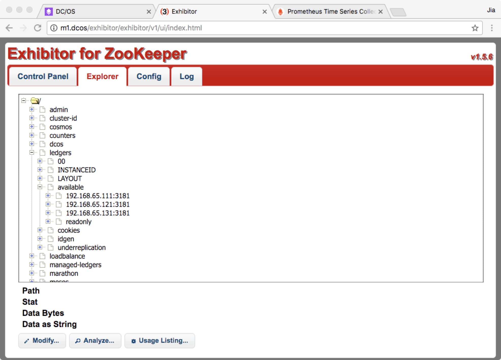

## The Pulsar broker Group

Similar to the BookKeeper group above, click into the **brokers** to check the status of the Pulsar brokers.

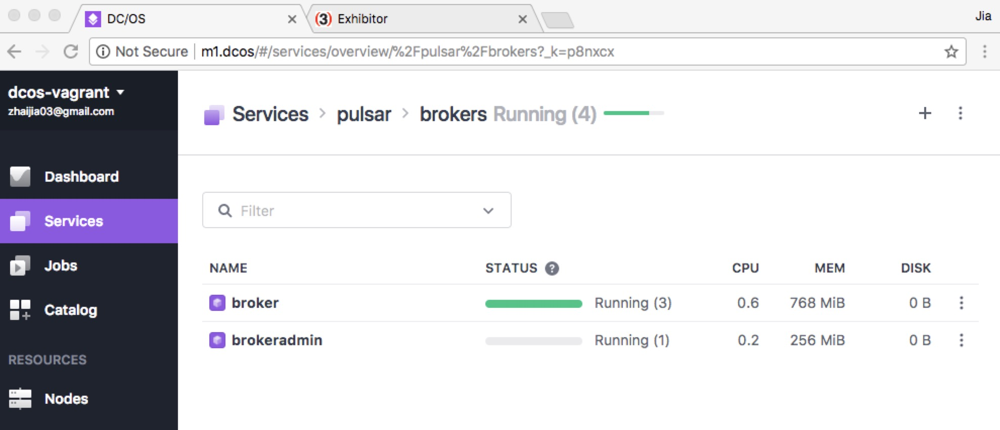

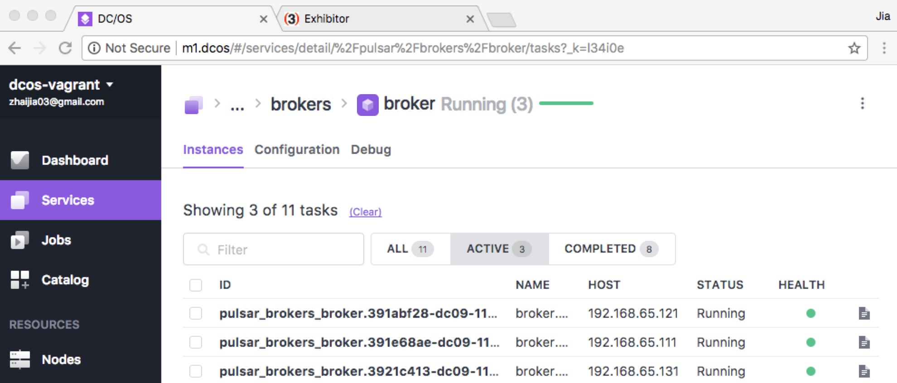

You can also click into each broker instance to get more detailed info, such as the broker running log.


Broker cluster information in Zookeeper is also available through the web UI. In this example, you can see that that the `loadbalance` and `managed-ledgers` directories have been created.

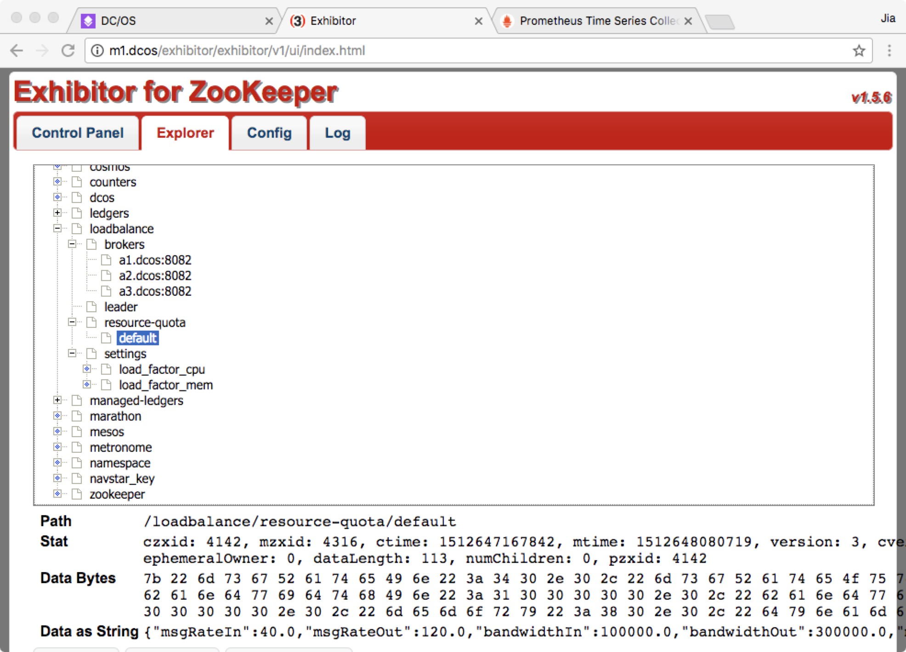

## Monitor Group

The **monitory** group consists of Prometheus and Grafana.

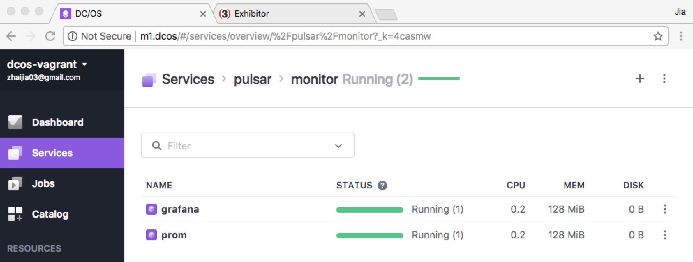

### Prometheus

Click into the instance of `prom` to get the endpoint of Prometheus, which is `192.168.65.121:9090` in this example.

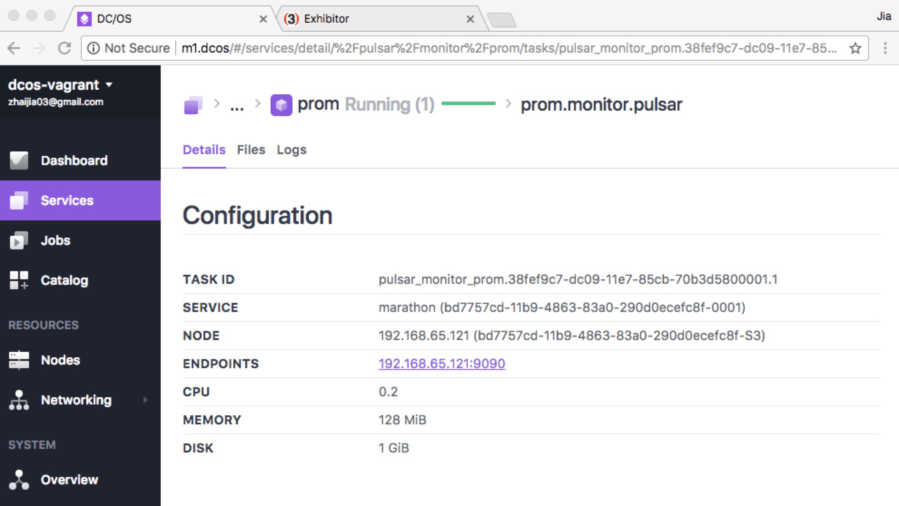

If you click that endpoint, you'll see the Prometheus dashboard. The [http://192.168.65.121:9090/targets](http://192.168.65.121:9090/targets) URL will display all the bookies and brokers.

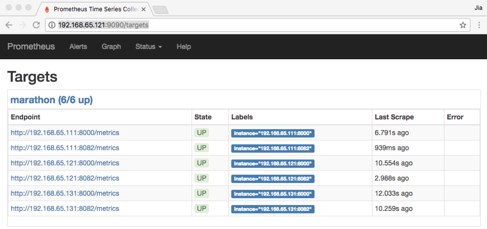

### Grafana

Click into `grafana` to get the endpoint for Grafana, which is `192.168.65.121:3000` in this example.
 
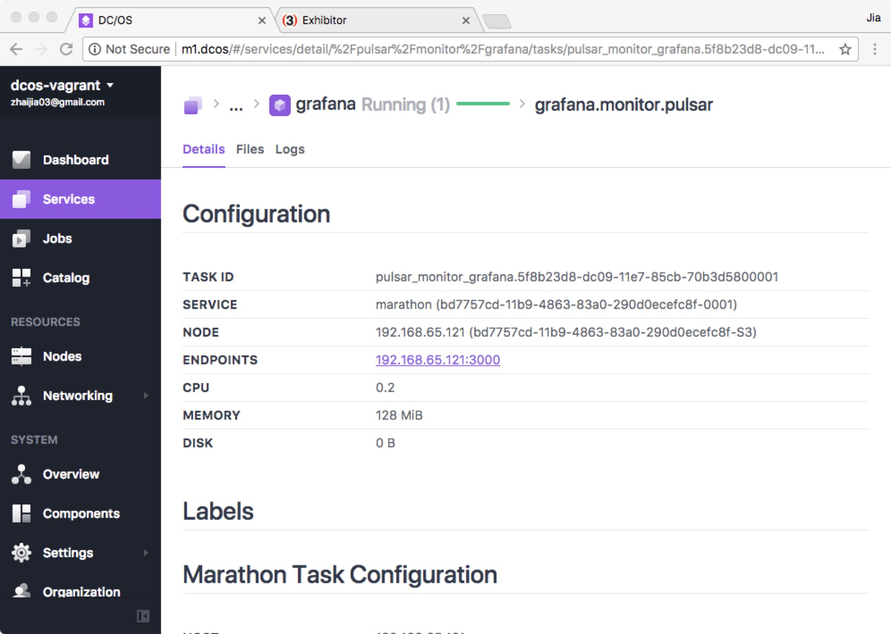

If you click that endpoint, you can access the Grafana dashbaord.

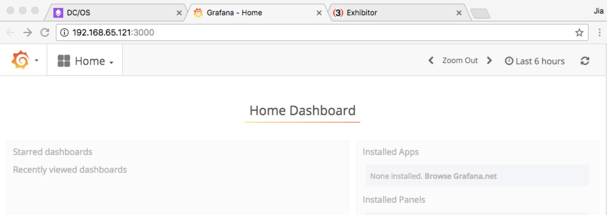

## Run a simple Pulsar consumer and producer on DC/OS

Now that we have a fully deployed Pulsar cluster, we can run a simple consumer and producer to show Pulsar on DC/OS in action.

### Download and prepare the Pulsar Java tutorial

There's a [Pulsar Java tutorial](https://github.com/streamlio/pulsar-java-tutorial) repo that you can clone. This repo contains a simple Pulsar consumer and producer (more info can be found in the repo's `README` file).

```bash
$ git clone https://github.com/streamlio/pulsar-java-tutorial
```

Change the `SERVICE_URL` from `pulsar://localhost:6650` to `pulsar://a1.dcos:6650` in both [`ConsumerTutorial.java`](https://github.com/streamlio/pulsar-java-tutorial/blob/master/src/main/java/tutorial/ConsumerTutorial.java) and [`ProducerTutorial.java`](https://github.com/streamlio/pulsar-java-tutorial/blob/master/src/main/java/tutorial/ProducerTutorial.java).
The `pulsar://a1.dcos:6650` endpoint is for the broker service. Endpoint details for each broker instance can be fetched from the DC/OS GUI. `a1.dcos` is a DC/OS client agent, which runs a broker. This can also be replaced by the client agent IP address.

Now, change the message number from 10 to 10000000 in main method of [`ProducerTutorial.java`](https://github.com/streamlio/pulsar-java-tutorial/blob/master/src/main/java/tutorial/ProducerTutorial.java) so that it will produce more messages.

Now compile the project code using command:

```bash
$ mvn clean package
```

### Run the consumer and producer

Execute this command to run the consumer:

```bash
$ mvn exec:java -Dexec.mainClass="tutorial.ConsumerTutorial"
```

Execute this command to run the producer:

```bash
$ mvn exec:java -Dexec.mainClass="tutorial.ProducerTutorial"
```

You can see the producer producing messages and the consumer consuming messages through the DC/OS GUI.

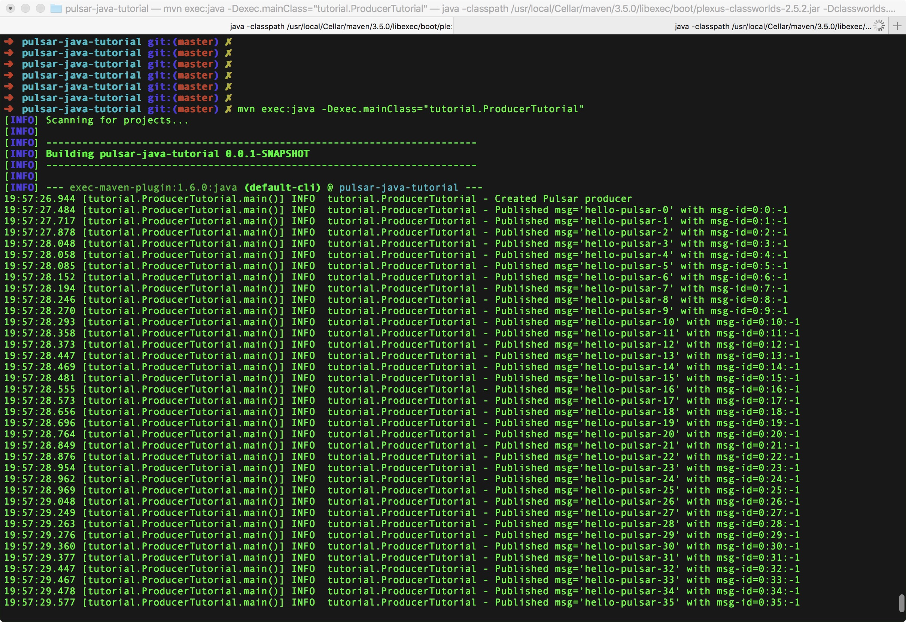

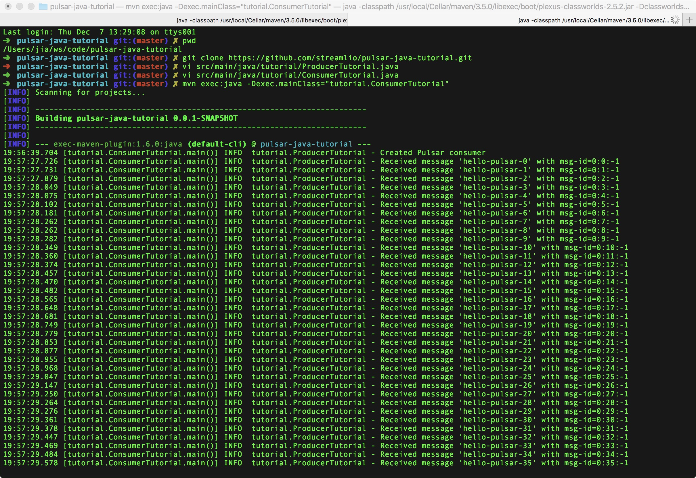

### View Grafana metric output

While the producer and consumer are running, you can access running metrics information from Grafana.

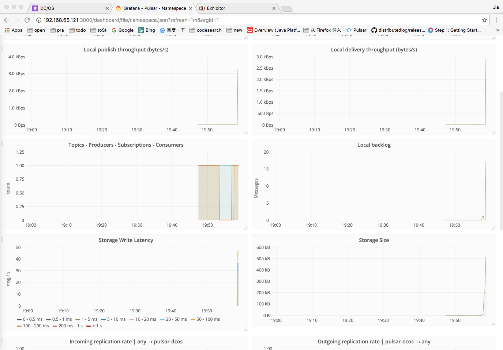


## Uninstall Pulsar

You can shut down and uninstall the `pulsar` application from DC/OS at any time in two ways:

1. Using the DC/OS GUI, you can choose **Delete** at the right end of Pulsar group.

    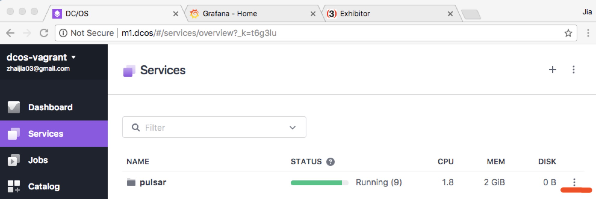

2. You can use the following command:

    ```bash
    $ dcos marathon group remove /pulsar
    ```
