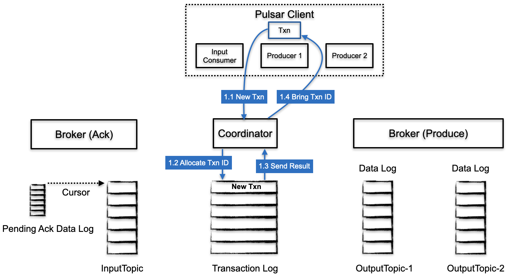
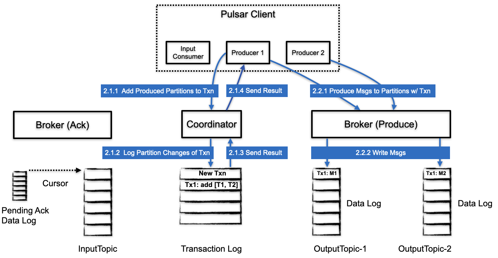
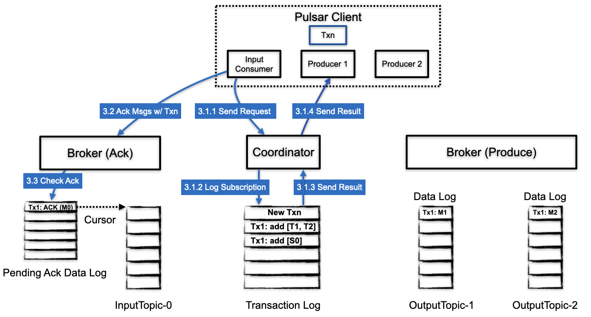
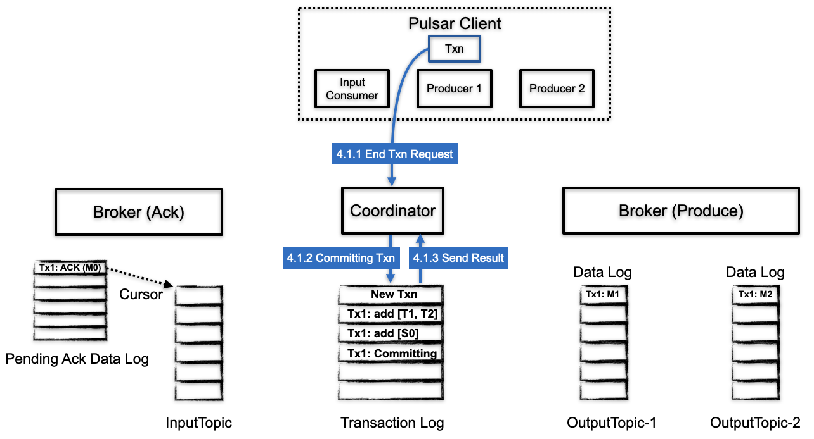
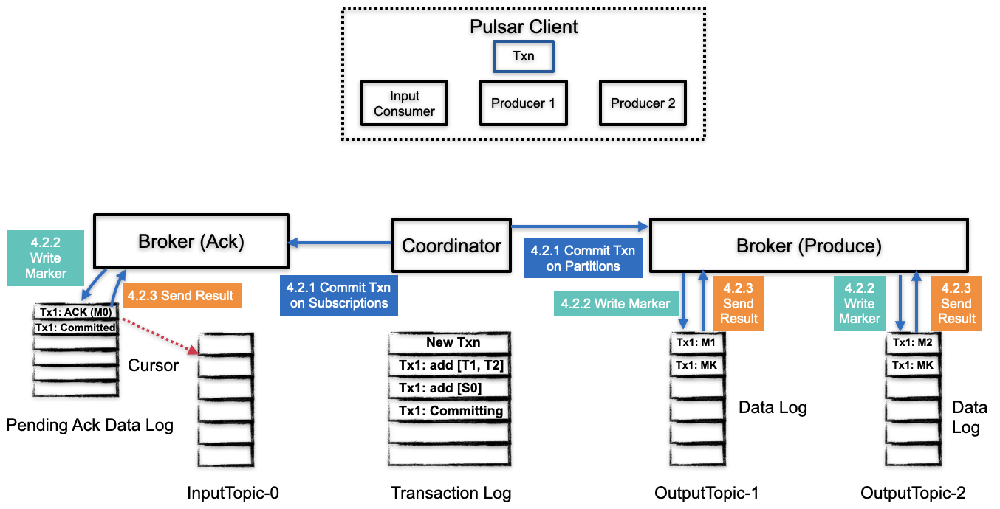
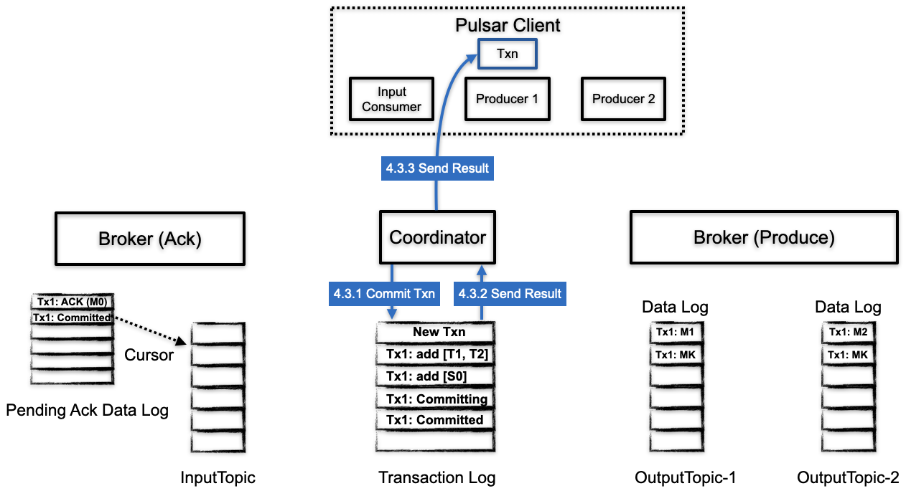

This section describes transaction components and how the components work together. For the complete design details, see [PIP-31: Transactional Streaming](https://docs.google.com/document/d/145VYp09JKTw9jAT-7yNyFU255FptB2_B2Fye100ZXDI/edit#heading=h.bm5ainqxosrx).

## Key concept

It is important to know the following key concepts, which is a prerequisite for understanding how transactions work.

### Transaction coordinator

The transaction coordinator (TC) is a module running inside a Pulsar broker. 

* It maintains the entire life cycle of transactions and prevents a transaction from getting into an incorrect status. 
  
* It handles transaction timeout, and ensures that the transaction is aborted after a transaction timeout.

### Transaction log

All the transaction metadata persists in the transaction log. The transaction log is backed by a Pulsar topic. If the transaction coordinator crashes, it can restore the transaction metadata from the transaction log.

The transaction log stores the transaction status rather than actual messages in the transaction (the actual messages are stored in the actual topic partitions). 

### Transaction buffer

Messages produced to a topic partition within a transaction are stored in the transaction buffer (TB) of that topic partition. The messages in the transaction buffer are not visible to consumers until the transactions are committed. The messages in the transaction buffer are discarded when the transactions are aborted. 

Transaction buffer stores all ongoing and aborted transactions in memory. All messages are sent to the actual partitioned Pulsar topics.  After transactions are committed, the messages in the transaction buffer are materialized (visible) to consumers. When the transactions are aborted, the messages in the transaction buffer are discarded.

### Transaction ID

Transaction ID (TxnID) identifies a unique transaction in Pulsar. The transaction ID is 128-bit. The highest 16 bits are reserved for the ID of the transaction coordinator, and the remaining bits are used for monotonically increasing numbers in each transaction coordinator. It is easy to locate the transaction crash with the TxnID.

### Pending acknowledge state

Pending acknowledge state maintains message acknowledgments within a transaction before a transaction completes. If a message is in the pending acknowledge state, the message cannot be acknowledged by other transactions until the message is removed from the pending acknowledge state.

The pending acknowledge state is persisted to the pending acknowledge log (cursor ledger). A new broker can restore the state from the pending acknowledge log to ensure the acknowledgement is not lost.    

## Data flow

At a high level, the data flow can be split into several steps:

1. Begin a transaction.
   
2. Publish messages with a transaction.
   
3. Acknowledge messages with a transaction.
   
4. End a transaction.

To help you debug or tune the transaction for better performance, review the following diagrams and descriptions. 

### 1. Begin a transaction

Before introducing the transaction in Pulsar, a producer is created and then messages are sent to brokers and stored in data logs. 

Let’s walk through the steps for _beginning a transaction_.

<table>
  <tr>
   <td>Step
   </td>
   <td>Description
   </td>
  </tr>
  <tr>
   <td>1.1 New Txn
   </td>
   <td>The first step is that the Pulsar client finds the transaction coordinator.
   </td>
  </tr>
  <tr>
   <td>1.2 Allocate Txn ID
   </td>
   <td>The transaction coordinator allocates a transaction ID for the transaction. In the transaction log, the transaction is logged with its transaction ID and status (OPEN), which ensures the transaction status is persisted regardless of transaction coordinator crashes. 
   </td>
  </tr>
  <tr>
   <td>1.3 Bring Txn ID
   </td>
   <td>After the transaction status entry is logged, the transaction coordinator brings the transaction ID back to the Pulsar client.
   </td>
  </tr>
</table>

### 2. Publish messages with a transaction

In this stage, the Pulsar client enters a transaction loop, repeating the `consume-process-produce` operation for all the messages that comprise the transaction. This is a long phase and is potentially composed of multiple produce and acknowledgement requests. 

Let’s walk through the steps for _publishing messages with a transaction_.

<table>
  <tr>
   <td>Step
   </td>
   <td>Description
   </td>
  </tr>
  <tr>
   <td>2.1.1 Add Produced Partitions to Txn
   </td>
   <td>Before the Pulsar client produces messages to a new topic partition, it sends a request to the transaction coordinator to add the partition to the transaction.
   </td>
  </tr>
  <tr>
   <td>2.1.2 Log Partition Changes of Txn
   </td>
   <td>The transaction coordinator logs the partition changes of the transaction into the transaction log for durability, which ensures the transaction coordinator knows all the partitions that a transaction is handling. The transaction coordinator can commit or abort changes on each partition at the end-partition phase.
   </td>
  </tr>
  <tr>
   <td>2.1.3 Send Result
   </td>
   <td>The transaction log sends the result of logging the new partition (used for producing messages) to the transaction coordinator.
   </td>
  </tr>
  <tr>
   <td>2.1.4 Send Result
   </td>
   <td>The transaction coordinator sends the result of adding a new produced partition to the transaction.
   </td>
  </tr>
  <tr>
   <td>2.2.1 Produce Msgs to Partitions w/Txn
   </td>
   <td>The Pulsar client starts producing messages to partitions. The flow of this part is the same as the normal flow of producing messages except that the batch of messages produced by a transaction contains transaction IDs. 
   </td>
  </tr>
  <tr>
   <td>2.2.2 Write Msgs
   </td>
   <td>The broker writes messages to a partition.
   </td>
  </tr>
</table>

### 3. Acknowledge messages with a transaction

In this phase, the Pulsar client sends a request to the transaction coordinator and a new subscription is acknowledged as a part of a transaction.

Let’s walk through the steps for _acknowledging messages with a transaction_.

<table>
  <tr>
   <td>Step
   </td>
   <td>Description
   </td>
  </tr>
  <tr>
   <td>3.1.1 Send Request
   </td>
   <td>The Pulsar client sends a request to add an acknowledged subscription to the transaction coordinator.
   </td>
  </tr>
  <tr>
   <td>3.1.2 Log Subscription
   </td>
   <td>The transaction coordinator logs the addition of subscription, which ensures that it knows all subscriptions handled by a transaction and can commit or abort changes on each subscription at the end phase.
   </td>
  </tr>
  <tr>
   <td>3.1.3 Send Result
   </td>
   <td>The transaction log sends the result of logging the new partition (used for acknowledging messages) to the transaction coordinator.
   </td>
  </tr>
  <tr>
   <td>3.1.4 Send Result
   </td>
   <td>The transaction coordinator sends the result of adding the new acknowledged partition to the transaction.
   </td>
  </tr>
  <tr>
   <td>3.2 Ack Msgs w/ Txn
   </td>
   <td>The Pulsar client acknowledges messages on the subscription. The flow of this part is the same as the normal flow of acknowledging messages except that the acknowledged request carries a transaction ID. 
   </td>
  </tr>
  <tr>
   <td>3.3 Check Ack
   </td>
   <td>The broker receiving the acknowledgement request checks if the acknowledgment belongs to a transaction or not. If it belongs to a transaction, the broker marks the message as in PENDING_ACK status, which means the message can not be acknowledged or negative-acknowledged by other consumers using the same subscription until the acknowledgement is committed or aborted. If there are two transactions attempting to acknowledge on one message with the same subscription, only one transaction succeeds and the other transaction is conflicted. The Pulsar client aborts the whole transaction when it tries to acknowledge but detects a conflict. The conflict can be detected on both individual acknowledgements and cumulative acknowledgements.
   </td>
  </tr>
</table>

### 4. End a transaction

At the end of a transaction, the Pulsar client decides to commit or abort the transaction. The transaction can be aborted when a conflict is detected on acknowledging messages. 

#### 4.1 End transaction request

When the Pulsar client finishes a transaction, it issues an end transaction request.

Let’s walk through the steps for _ending the transaction_.

<table>
  <tr>
   <td>Step
   </td>
   <td>Description
   </td>
  </tr>
  <tr>
   <td>4.1.1 End Txn request
   </td>
   <td>The Pulsar client issues an end transaction request (with a field indicating whether the transaction is to be committed or aborted) to the transaction coordinator. 
   </td>
  </tr>
  <tr>
   <td>4.1.2 Committing Txn
   </td>
   <td>The transaction coordinator writes a COMMITTING or ABORTING message to its transaction log.
   </td>
  </tr>
  <tr>
   <td>4.1.3 Send Results
   </td>
   <td>The transaction log sends the result of logging the committing or aborting status.
   </td>
  </tr>
</table>

#### 4.2 Finalize a transaction

The transaction coordinator starts the process of committing or aborting messages or acknowledgments to all the partitions involved in this transaction. 

Let’s walk through the steps for _finalizing a transaction_.

<table>
  <tr>
   <td>Step
   </td>
   <td>Description
   </td>
  </tr>
  <tr>
   <td>4.2.1 Commit Txn on Subscriptions
   </td>
   <td>The transaction coordinator commits transactions on subscriptions and commits transactions on partitions at the same time.
   </td>
  </tr>
  <tr>
   <td>4.2.2 Write Marker
   </td>
   <td>The broker (produce) writes produced committed markers to the actual partitions. At the same time, the broker (ack) writes acked committed marks to the subscription pending ack partitions.
   </td>
  </tr>
  <tr>
   <td>4.2.3 Send Result
   </td>
   <td>The data log sends the result of writing produced committed marks to the broker. At the same time, pending ack data log sends the result of writing acked committed marks to the broker. The cursor moves to the next position.
<ul>

<li>If the transaction is committed, the PENDING ACK status becomes `ACK` status.

<li>If the transaction is aborted, the PENDING ACK status becomes UNACK status. (Aborting an acknowledgment results in the message being re-delivered to other consumers.)
</li>
</ul>
   </td>
  </tr>
</table>

#### 4.3 Mark a transaction as COMMITTED or ABORTED

The transaction coordinator writes the final transaction status to the transaction log to complete the transaction.

Let’s walk through the steps for _marking a transaction as COMMITTED or ABORTED_.

<table>
  <tr>
   <td>Step
   </td>
   <td>Description
   </td>
  </tr>
  <tr>
   <td>4.3.1 Commit Txn
   </td>
   <td>After all produced messages and acknowledgements to all partitions involved in this transaction have been successfully committed or aborted, the transaction coordinator writes the final COMMITTED or ABORTED transaction status messages to its transaction log, indicating that the transaction is complete. All the messages associated with the transaction in its transaction log can be safely removed.
   </td>
  </tr>
  <tr>
   <td>4.3.2 Send Result
   </td>
   <td>The transaction log sends the result of the committed transaction to the transaction coordinator.
   </td>
  </tr>
  <tr>
   <td>4.3.3 Send Result
   </td>
   <td>The transaction coordinator sends the result of the committed transaction to the Pulsar client.
   </td>
  </tr>
</table>
